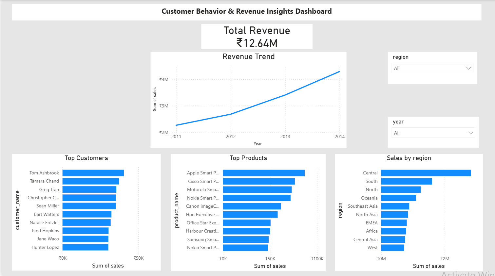

# Customer Behavior & Revenue Insights Dashboard

##  Project Overview

This project analyzes customer behavior and revenue performance using SQL and Power BI. The goal is to transform raw sales data into meaningful business insights and present them through an interactive dashboard.

---

##  Dataset

* Superstore Sales Dataset
* ~51,000 records
* Time period: 2011 – 2014
- <a href="https://github.com/Likith2310/Customer-behavior-revenue-insights-dashboard/blob/main/SuperStoreOrders.csv">Dataset</a>

---

##  Tools & Technologies

* SQL Server (Data Cleaning & Analysis)
* Power BI (Data Visualization & Dashboarding)
* Excel (Initial data exploration)

---

##  Project Workflow

### 1. Data Preparation (SQL)

* Imported raw CSV dataset into SQL Server
* Cleaned and structured data
* Verified data types and handled inconsistencies

### 2. Data Analysis (SQL)

* Calculated total revenue
* Analyzed year-wise revenue trends
* Identified top customers and top products
* Evaluated regional sales performance
* Identified loss-making transactions

### 3. Data Visualization (Power BI)

Developed an interactive dashboard including:

*  Total Revenue KPI
*  Revenue Trend (2011–2014)
*  Top 10 Customers
*  Top 10 Products
*  Sales by Region
*  Filters (Year & Region)

---

##  Key Insights

* Revenue shows consistent growth from 2011 to 2014
* A small group of customers contributes significantly to total revenue
* Certain products dominate overall sales
* Regional performance varies, indicating growth opportunities
* A portion of transactions are loss-making, highlighting profitability concerns

---

##  Dashboard Preview

---

##  Learnings

* Improved SQL querying and data analysis skills
* Gained hands-on experience in Power BI dashboard development
* Learned how to derive business insights from raw data

---

##  Future Improvements

* Add profit analysis dashboard
* Implement advanced DAX calculations
* Enhance dashboard design and interactivity

---

##  Conclusion

This project demonstrates the ability to analyze real-world data, extract meaningful insights, and present them through a clean and interactive dashboard.
